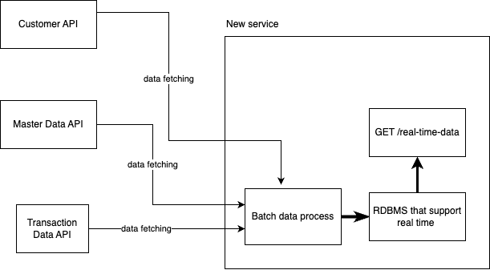

# BE-Q1

## **Assuming the system currently has three microservices: Customer API, Master Data API, and Transaction Data API, there is a new feature that requires data from all three microservices to be displayed in near real-time. The current technology stack includes REST APIs and an RDBMS database. How would you design a new API for this feature?**

### **The overview new system is show below**

**Explain for new system design**

- The system's existing architecture consists of REST APIs and an RDBMS database. To integrate with the new service domain, data transfer processes follow these principles:
    - For small-sized data, REST APIs will handle data fetching, as illustrated in the new system diagram.
    - For large batch data, the batch processing component of the new service will directly connect to the micro services database to efficiently handle the data transfer.
- **Post-Processing Storage**:
    
    After the batch processing is completed, the processed data will be stored in a real-time capable RDBMS database, such as PostgreSQL or CockroachDB, ensuring quick and reliable access.
    
- **Real-Time Data Access**:
    
    A designated API endpoint will provide access to real-time processed data:
    
    - **Endpoint**: `GET /real-time-data`
    - **Functionality**: This API retrieves the latest processed data and allows users to query compiled data within a specific range.