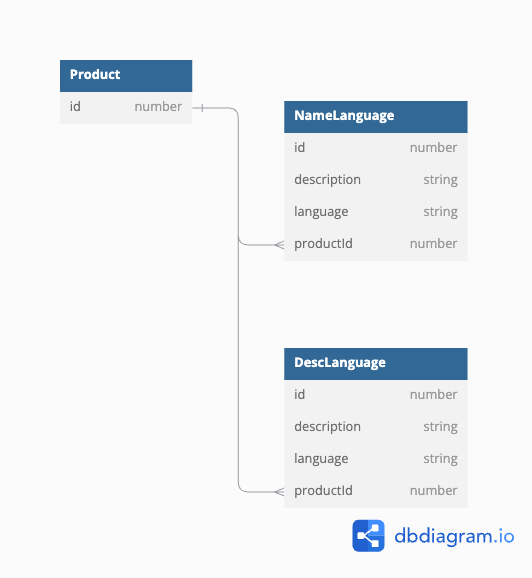

# BE-Q3

Gitlab https://gitlab.com/nessica98/test-api-3

### **Vaidation**

**Create API**

- POST `/product`
- Support create product with product name and product detail that support TH / EN language

Spec

|  |  | type | required |
| --- | --- | --- | --- |
| productName |  | Object |  |
|  | th | string | ✅ |
|  | en | string | ✅ |
| productDescription |  | Object |  |
|  | th | string | ✅ |
|  | en | string | ✅ |

###  Example 
```
{
    "productName": {
        "th": "ทดสอบ",
        "en": "test"
    },
    "productDescription": {
        "th": "ทดสอบ รายละเอียด",
        "en": "test detail"
    }
}
```
**Search API**

- GET `/product`
- Use query params to support search and pagination
- sample param `products?page=1&size=5&keyword=test`
    - page : which page to query (default = 1)
    - size: the number of record per page (default = 10)
    - keyword: part of product name to query

**Database Design**



- Table : Product → Keep product record
- Table : NameLanguage → Keep each product name and support multiple languages
    - use product id as FK to refer to a product
- Table : DescLanguage → Keep each product name and support multiple languages
    - use product id as FK to refer to a product

NameLanguage and DescLanguage table have the same schema.

**Testing Strategy**

- Unit test - Handle unit test by test module in Nest.js. Each service and utility function should be covered with unit tests and have coverage with the whole functionality.
- Integration test - Handle both API functionality that consists of a search and a create API.
    - Search API
        - Pagination can get data correctly.
        - Able to use search keywords and find data correctly
    - Create API
        - Check that can create a product in the database correctly (product name and description in multiple languages can also be kept in the database).
- End-to-end test: Handle tests with other services that work with APIs or front-end services that can get/create data correctly along with the service.